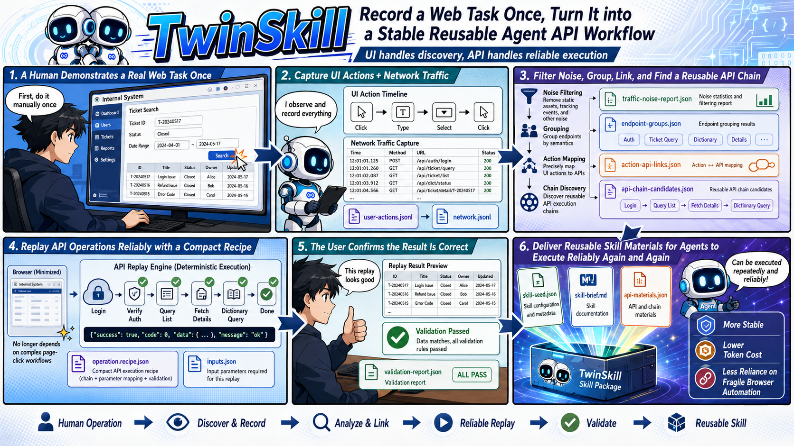
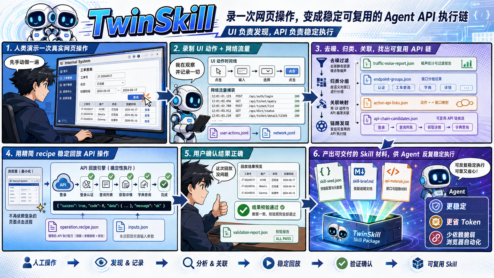

# TwinSkill

<p align="center">
  <a href="#english">English</a> | <a href="#中文">中文</a>
</p>

---

## English

**TwinSkill copies a human web operation once, then turns it into a stable, reusable API execution chain for agents.**

Instead of asking an LLM agent to repeatedly click through the browser, TwinSkill records one demonstrated UI workflow, analyzes the runtime network traffic, recovers the useful API chain, verifies deterministic replay, and packages the result as skill-ready material. The goal is stable repeated execution with lower token cost and less fragile browser automation.



### Core Idea

```text
human demonstrates one browser workflow
-> TwinSkill records UI actions + runtime network traffic
-> denoise static/background/telemetry traffic
-> normalize and group API-like endpoints
-> link useful API chains to the demonstrated task
-> replay the selected API chain
-> user confirms the replay result
-> finalize skill-ready materials
```

UI operation is the discovery path and fallback. Verified API replay is the durable execution path.

### What TwinSkill Produces

Each run is isolated under `runs/<task-name>/` and may contain:

```text
runs/<task-name>/
  run-manifest.json
  storage-state.json
  session.json
  network.jsonl
  user-actions.jsonl
  environment.json
  api-analysis.json
  endpoint-groups.json
  traffic-noise-report.json
  action-api-links.json
  api-chain-candidates.json
  operation.recipe.draft.json
  operation.recipe.json
  inputs.json
  validation.json
  replay-acceptance.json
  api-materials.json
  skill-seed.json
  skill-brief.md
  results.jsonl
  ui-replay-report.json
  downloads/
  debug-snapshots/
```

Run artifacts are ignored by git because they may contain cookies, tokens, intranet URLs, request bodies, downloaded files, or business data.

### Why This Saves Tokens

Browser agents spend tokens observing pages, deciding what to click, recovering from UI changes, and repeating the same reasoning on every run. TwinSkill moves that work into a one-time capture and verification step. Later runs can execute a compact recipe through deterministic scripts, using tokens only for high-level decisions, validation summaries, and exception handling.

### TwinSkill 2.0 API Analysis

The analyzer does not select useful APIs by score alone. It follows an APISENSOR-inspired workflow adapted to task-level replay:

- `traffic-noise-report.json`: filters static assets, telemetry, full documents, and background traffic.
- `endpoint-groups.json`: groups API-like requests by method, origin, normalized path template, and query-key signature.
- `action-api-links.json`: links endpoint groups to recorded UI action windows.
- `api-chain-candidates.json`: proposes ordered API chains likely to reproduce the demonstrated task.
- `api-analysis.json`: complete analysis bundle, including a legacy ranked candidate view.

Scores are supporting evidence only. The final selection should be a replayable API chain with declared inputs, captured state, and verifiable outputs.

### Installation

```bash
git clone https://github.com/Jiegenglyu/TwinSkill.git ~/.twinskill
npm --prefix ~/.twinskill install
```

If your agent supports a skill directory:

```bash
mkdir -p ~/.agent-skills
ln -sfn ~/.twinskill/twinskill ~/.agent-skills/twinskill
```

For Codex:

```bash
git clone https://github.com/Jiegenglyu/TwinSkill.git "${CODEX_HOME:-$HOME/.codex}/twinskill-repo"
npm --prefix "${CODEX_HOME:-$HOME/.codex}/twinskill-repo" install

mkdir -p "${CODEX_HOME:-$HOME/.codex}/skills"
ln -sfn \
  "${CODEX_HOME:-$HOME/.codex}/twinskill-repo/twinskill" \
  "${CODEX_HOME:-$HOME/.codex}/skills/twinskill"
```

Restart Codex after installation. The skill should be available as:

```text
$twinskill
```

### Usage

Install dependencies from the repository root:

```bash
npm install
```

Record one human operation:

```bash
npm run record -- "https://internal.example.com/report" runs/export-report
```

Use the opened browser to complete the exact operation once, then press Enter in the terminal.

Analyze the captured network traffic:

```bash
npm run analyze -- \
  runs/export-report/network.jsonl \
  runs/export-report/api-analysis.json \
  runs/export-report/user-actions.jsonl
```

Inspect `api-chain-candidates.json`, `action-api-links.json`, and `endpoint-groups.json` before writing `operation.recipe.draft.json`.

Replay the selected API operation:

```bash
npm run replay -- \
  runs/export-report/operation.recipe.draft.json \
  runs/export-report/inputs.json \
  runs/export-report
```

Finalize only after the user confirms the API replay result is correct:

```bash
npm run finalize-api -- \
  runs/export-report \
  --user-confirmed \
  --confirmed-by=user
```

### Design Principles

- Copy the human operation once; avoid repeated fragile browser automation.
- Use UI interaction for intent capture and API discovery.
- Prefer verified API replay for stable repeated execution.
- Preserve raw materials locally and expose compact summaries to the agent.
- Keep secrets out of chat, git, prompts, and final answers.
- Require explicit user confirmation before promoting final API materials.
- Treat `skill-seed.json` and `skill-brief.md` as the handoff into a later formal Skill.

### Repository Layout

```text
twinskill/
  SKILL.md
  agents/openai.yaml
  references/environment.md
  references/selectors.md
  references/api-strategy.md
  references/api-recipe.md
  references/recovery.md
  references/skill-production.md
  scripts/runtime-profile.mjs
  scripts/preflight.mjs
  scripts/debug-snapshot.mjs
  scripts/human-record.mjs
  scripts/record-network.mjs
  scripts/analyze-network.mjs
  scripts/summarize-network.mjs
  scripts/replay-ui.mjs
  scripts/run-operation.mjs
  scripts/finalize-api-materials.mjs
```

### Status

Prototype, TwinSkill 2.0 direction. The recorder, standard runtime, preflight, text-first debug snapshots, UI replay, API replay finalization, Skill seed generation, endpoint grouping, noise reporting, action-to-API linking, and chain-candidate analysis are implemented. Automatic recipe synthesis, full UI-vs-API equivalence checking, multi-run diffing, and broad enterprise recovery remain active research and engineering work.

---

## 中文

**TwinSkill 的目标是：复制一次人的网页操作，把它变成稳定、可复用的 Agent API 执行链。**

不要让 LLM Agent 每次都重新观察页面、思考点击、处理 UI 抖动。TwinSkill 记录一次人的 UI 操作，分析运行时网络流量，恢复对当前任务真正有用的 API 链路，验证确定性 API 重放，然后产出可生成 Skill 的材料。核心收益是稳定重复执行，并减少后续复用时的 token 消耗。



### 核心思路

```text
人示范一次浏览器工作流
-> TwinSkill 记录 UI 动作 + 运行时网络流
-> 过滤静态资源、后台请求、埋点和遥测噪声
-> 归一化并聚合 API-like endpoint
-> 把有用 API 链路对齐到人的操作意图
-> 重放选中的 API 链路
-> 用户确认重放结果正确
-> 产出 skill-ready materials
```

UI 操作是发现路径和兜底策略。经过验证的 API replay 才是长期稳定执行路径。

### TwinSkill 会产出什么

每次运行都隔离保存在 `runs/<task-name>/` 下，典型文件包括：

```text
runs/<task-name>/
  run-manifest.json
  storage-state.json
  session.json
  network.jsonl
  user-actions.jsonl
  environment.json
  api-analysis.json
  endpoint-groups.json
  traffic-noise-report.json
  action-api-links.json
  api-chain-candidates.json
  operation.recipe.draft.json
  operation.recipe.json
  inputs.json
  validation.json
  replay-acceptance.json
  api-materials.json
  skill-seed.json
  skill-brief.md
  results.jsonl
  ui-replay-report.json
  downloads/
  debug-snapshots/
```

这些运行产物默认不进 git，因为可能包含 cookie、token、内网 URL、请求体、下载文件或业务数据。

### 为什么能节省 token

浏览器 Agent 每次执行同一个任务时，都会消耗 token 去观察页面、决定点击、处理 UI 变化和错误恢复。TwinSkill 把这些成本前置到一次录制和验证里。后续复用时，只需要执行紧凑的 recipe 和确定性脚本，token 主要用于高层决策、结果摘要和异常处理。

### TwinSkill 2.0 API 分析

TwinSkill 不再把“有用 API”当成单纯的打分排序问题。它参考 APISENSOR 的思路，但目标不是发现全部 API surface，而是恢复当前任务的可执行 API 链路：

- `traffic-noise-report.json`：过滤静态资源、埋点、完整 HTML 文档和后台流量。
- `endpoint-groups.json`：按 method、origin、归一化路径模板、query key 签名聚合 API-like 请求。
- `action-api-links.json`：把 endpoint group 对齐到录制到的 UI action window。
- `api-chain-candidates.json`：提出可能复现当前任务的有序 API 链路。
- `api-analysis.json`：完整分析包，包含兼容旧流程的 ranked candidates 视图。

分数只是辅助证据。最终选择的应该是一个可以 replay 的 API chain，包含声明输入、状态捕获和可验证输出。

### 安装

```bash
git clone https://github.com/Jiegenglyu/TwinSkill.git ~/.twinskill
npm --prefix ~/.twinskill install
```

如果你的 Agent 支持 skill 目录：

```bash
mkdir -p ~/.agent-skills
ln -sfn ~/.twinskill/twinskill ~/.agent-skills/twinskill
```

Codex 安装方式：

```bash
git clone https://github.com/Jiegenglyu/TwinSkill.git "${CODEX_HOME:-$HOME/.codex}/twinskill-repo"
npm --prefix "${CODEX_HOME:-$HOME/.codex}/twinskill-repo" install

mkdir -p "${CODEX_HOME:-$HOME/.codex}/skills"
ln -sfn \
  "${CODEX_HOME:-$HOME/.codex}/twinskill-repo/twinskill" \
  "${CODEX_HOME:-$HOME/.codex}/skills/twinskill"
```

重启 Codex 后，Skill 应该可以通过下面的名字使用：

```text
$twinskill
```

### 使用

在仓库根目录安装依赖：

```bash
npm install
```

录制一次人的操作：

```bash
npm run record -- "https://internal.example.com/report" runs/export-report
```

在打开的浏览器里完成目标操作一次，然后回到终端按 Enter 结束录制。

分析捕获到的网络流量：

```bash
npm run analyze -- \
  runs/export-report/network.jsonl \
  runs/export-report/api-analysis.json \
  runs/export-report/user-actions.jsonl
```

在编写 `operation.recipe.draft.json` 前，优先查看 `api-chain-candidates.json`、`action-api-links.json` 和 `endpoint-groups.json`。

重放选中的 API 操作：

```bash
npm run replay -- \
  runs/export-report/operation.recipe.draft.json \
  runs/export-report/inputs.json \
  runs/export-report
```

只有在用户明确确认 API replay 结果正确后，才 finalize：

```bash
npm run finalize-api -- \
  runs/export-report \
  --user-confirmed \
  --confirmed-by=user
```

### 设计原则

- 复制一次人的操作，避免反复脆弱的浏览器自动化。
- UI 交互用于采集意图和发现 API。
- 稳定重复执行优先使用经过验证的 API replay。
- 原始材料保存在本地，只把紧凑摘要交给 Agent。
- 不把 secret 放进聊天、git、prompt 或最终回答。
- API 材料升级为 final 前必须有用户明确确认。
- `skill-seed.json` 和 `skill-brief.md` 是生成正式 Skill 的交接材料。

### 仓库结构

```text
twinskill/
  SKILL.md
  agents/openai.yaml
  references/environment.md
  references/selectors.md
  references/api-strategy.md
  references/api-recipe.md
  references/recovery.md
  references/skill-production.md
  scripts/runtime-profile.mjs
  scripts/preflight.mjs
  scripts/debug-snapshot.mjs
  scripts/human-record.mjs
  scripts/record-network.mjs
  scripts/analyze-network.mjs
  scripts/summarize-network.mjs
  scripts/replay-ui.mjs
  scripts/run-operation.mjs
  scripts/finalize-api-materials.mjs
```

### 状态

当前是 TwinSkill 2.0 原型。已实现录制器、标准运行环境、preflight、文本优先 debug snapshot、UI replay、API replay finalization、Skill seed 生成、endpoint grouping、noise reporting、action-to-API linking 和 chain-candidate analysis。自动 recipe synthesis、完整 UI-vs-API 等价验证、多次运行 diff、广泛企业场景恢复仍是后续研究和工程工作。
